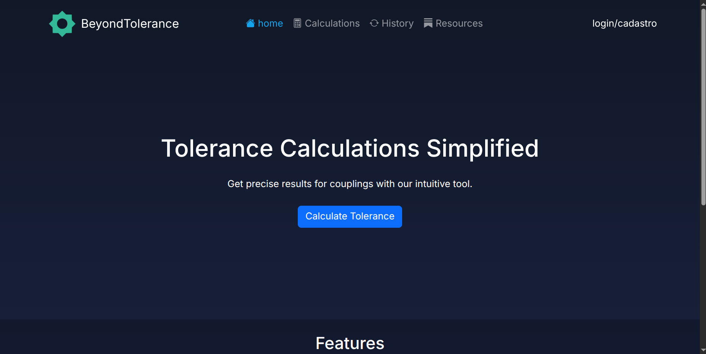
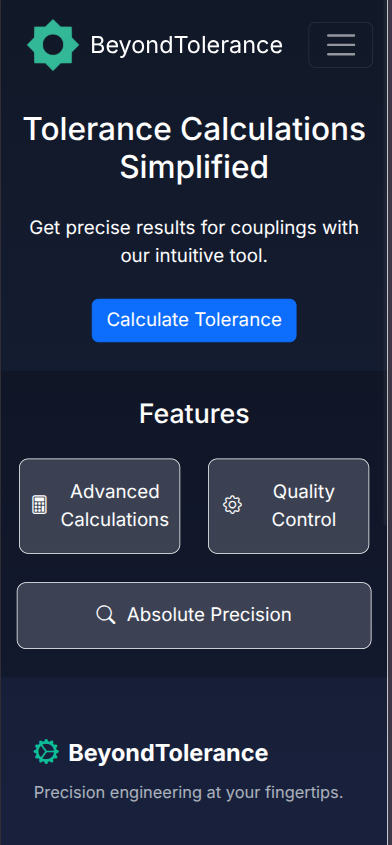
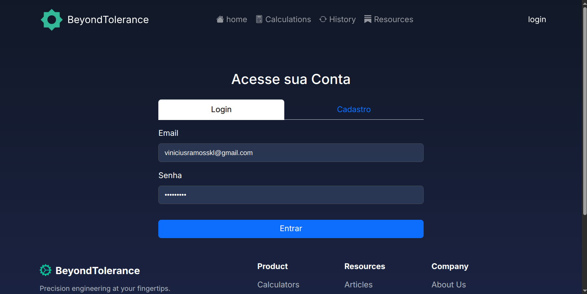
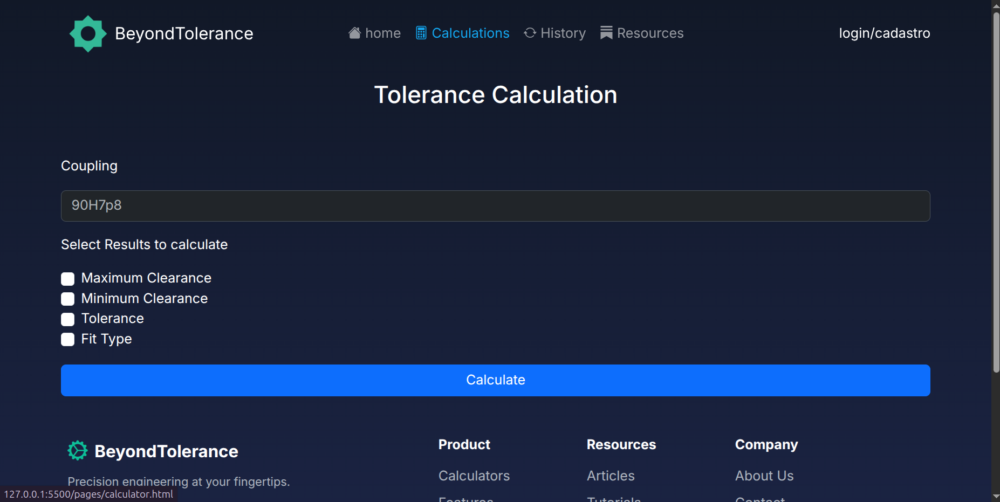
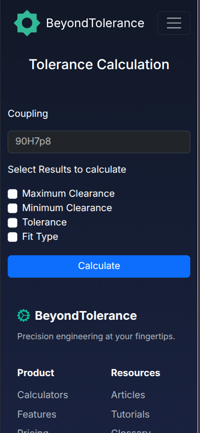
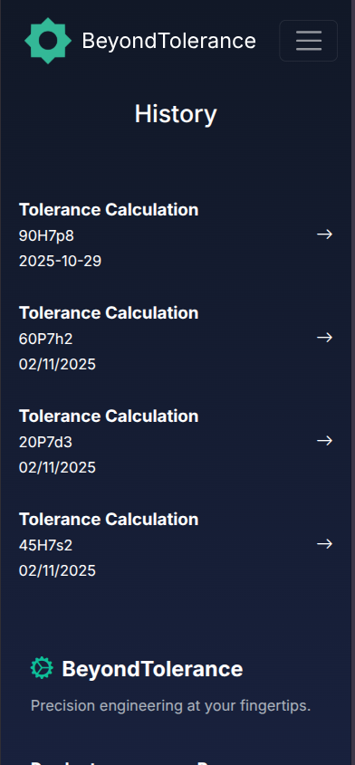
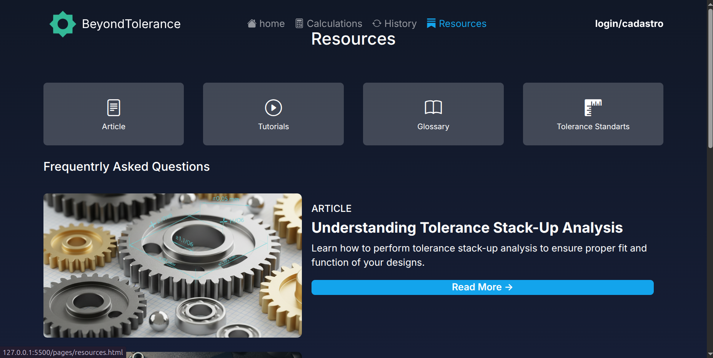
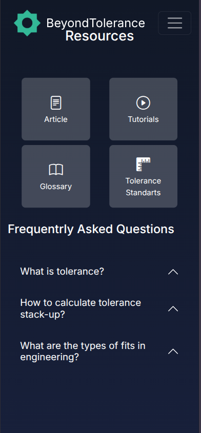

# BeyondTolerance

## 👤 Autor

- **Aluno:** Vinicius Campos De Ramos

## 📖 Descrição do Projeto

**BeyondTolerance** é uma aplicação web de múltiplas páginas, focada em fornecer ferramentas para engenharia e manufatura. A principal funcionalidade da aplicação é uma calculadora de tolerância e ajuste (ex: "90H7p8"), que valida a entrada do usuário usando Expressão Regular (REGEX) e o plugin jQuery Mask.

A aplicação utiliza duas integrações de API distintas:

1.  **API Fake (JSON Server):** O escopo desta API é a persistência dos dados da calculadora. Requisições assíncronas (`fetch`) são usadas para:
    - **POST:** Salvar os valores de cálculo e a data no endpoint `/calculations`.
    - **GET:** Consumir os dados salvos e exibi-los dinamicamente na página de Histórico.

2.  **API Pública (ViaCEP):** O escopo desta API é aprimorar a experiência de usuário no formulário de cadastro. Ao digitar o CEP, uma requisição `fetch` é disparada para a API `https://viacep.com.br`, que retorna e preenche automaticamente os campos de endereço (rua, bairro, cidade, estado).

---

## 🎨 Design e Prototipação

- **Prototipação no Figma:** https://www.figma.com/design/zBLHzXyBZWiwYJWpMZPKrA/Projeto-de-Framework?node-id=0-1&t=Gwzg8l0fLUQZXPFU-1

---

## 🛠️ Tecnologias e Dependências

- **Framework CSS:** Bootstrap
- **Dependências JavaScript:**
  - `bootstrap`
  - `jquery`
  - `jquery-mask-plugin`
  - `json-server`

---

## 🌐 Link para o Site em Produção

https://github.com/vine-cr/BeyondTolerance

---

## 📖 Checklist | Indicadores de Desempenho (ID)

### RA1 - Utilizar Frameworks CSS para estilização de elementos HTML e criação de layouts responsivos.

| ID  | Indicador                                      | Status      | Observações                                                                                            |
| :-- | :--------------------------------------------- | :---------- | :----------------------------------------------------------------------------------------------------- |
| 01  | Prototipa interfaces (Figma, etc.)             | **[x] Sim** | O arquivo de design Figma foi fornecido.                                                               |
| 02  | Implementa layout responsivo com Framework CSS | **[x] Sim** | Utiliza o sistema de grid do Bootstrap (ex: `container`, `row`, `col-lg-5`, `col-md-6`).               |
| 03  | Implementa layout responsivo com CSS puro      | **[x] Sim** | O arquivo `_style.scss` contém `media queries` (ex: `@media (max-width: 991.98px)`).                   |
| 04  | Utiliza componentes prontos e JS do framework  | **[x] Sim** | **CSS:** `navbar`, `card`, `btn`. **JS:** `navbar-toggler`, Tabs (`data-bs-toggle="tab"`) e Accordion. |
| 05  | Cria layout fluido (unidades relativas)        | **[x] Sim** | O `_style.scss` utiliza `rem` e `vh` (ex: `.logo { height: 4rem; }`, `body { min-height: 100vh; }`).   |
| 06  | Aplica um Design System consistente            | **[x] Sim** | O `_vars.scss` define variáveis de cor (ex: `$primary`) usadas globalmente.                            |
| 07  | Utiliza Sass (variáveis, mixins, funções)      | **[x] Sim** | Utiliza **variáveis** e importações.                                                                   |
| 08  | Aplica tipografia responsiva (mobile first)    | **[x] Sim** | Utiliza `media queries`, com a abordagem de "mobile-first" (`min-width`).                              |
| 09  | Aplica técnicas de responsividade de imagens   | **[x] Sim** | Utiliza a classe `.img-fluid` do Bootstrap.                                                            |
| 10  | Otimiza imagens (formatos, carregamento)       | **[x] Sim** | Utiliza formatos modernos (**WebP**), e implementa carregamento adaptativo (`srcset` ou `<picture>`).  |

### RA2 - Realizar tratamento de formulários e aplicar validações customizadas no lado cliente.

| ID  | Indicador                                   | Status      | Observações                                                                                              |
| :-- | :------------------------------------------ | :---------- | :------------------------------------------------------------------------------------------------------- |
| 11  | Implementa validação HTML nativa            | **[x] Sim** | Os formulários usam `required` e `type="email"`.                                                         |
| 12  | Aplica expressões regulares (REGEX)         | **[x] Sim** | `script.js` utiliza `toleranceRegex` para validar o formato do input de tolerância.                      |
| 13  | Utiliza elementos de seleção em formulários | **[x] Sim** | O formulário da calculadora (`calculator.html`) utiliza `type="checkbox"`.                               |
| 14  | Implementa leitura e escrita no Web Storage | **[x] Sim** | O `script.js` usa `localStorage` para registro/login e `sessionStorage` para a sessão ativa. |

### RA3 - Aplicar ferramentas para otimização do processo de desenvolvimento web.

| ID  | Indicador                                           | Status      | Observações                                                                                 |
| :-- | :-------------------------------------------------- | :---------- | :------------------------------------------------------------------------------------------ |
| 15  | Configura ambiente com Node.js e NPM                | **[x] Sim** | O projeto contém o arquivo `package.json` com dependências e scripts.                       |
| 16  | Utiliza boas práticas de versionamento (.gitignore) | **[x] Sim** | O arquivo `.gitignore` esta localizado nos arquivos do projeto.                             |
| 17  | Mantém um README.md padronizado                     | **[x] Sim** | O arquivo `README.md` está presente e sendo estruturado.                                    |
| 18  | Organiza arquivos do projeto de forma modular       | **[x] Sim** | O projeto segue uma estrutura clara, separando `pages`, `assets` (com `scss`, `js`, `img`). |
| 19  | Configura linters e formatadores (ESLint, Prettier) | **[x] Sim** | O `package.json` inclui `prettier` nas dependências ou scripts.                             |

### RA4 - Aplicar bibliotecas de funções e componentes em JavaScript para aprimorar a interatividade de páginas web.

| ID  | Indicador                              | Status      | Observações                                                                                                |
| :-- | :------------------------------------- | :---------- | :--------------------------------------------------------------------------------------------------------- |
| 20  | Utiliza jQuery para manipulação do DOM | **[x] Sim** | `script.js` usa `$(document).ready` e seletores jQuery como `$('#toleranceInput')`.                        |
| 21  | Integra e configura um plugin jQuery   | **[x] Sim** | O `jquery-mask-plugin` é importado e utilizado no `script.js` com `$('#toleranceInput').mask('SS0S0S0');`. |

### RA5 - Efetuar requisições assíncronas para uma API fake e APIs públicas, permitindo a obtenção e manipulação de dados dinamicamente.

| ID  | Indicador                                 | Status      | Observações                                                                                                   |
| :-- | :---------------------------------------- | :---------- | :------------------------------------------------------------------------------------------------------------ |
| 22  | Realiza requisições (API fake - POST)     | **[x] Sim** | A função `saveCalculation` usa `fetch` com `method: 'POST'` para `http://localhost:3000/calculations`.        |
| 23  | Realiza requisições (API fake - GET)      | **[x] Sim** | A função `loadHistory` usa `fetch` (GET) para buscar dados de `http://localhost:3000/calculations`.           |
| 24  | Realiza requisições (APIs públicas reais) | **[x] Sim** | `script.js` realiza `fetch` para a API pública do ViaCEP (`https://viacep.com.br`) no formulário de cadastro. |

---

## 🚀 Instruções de Execução

Siga os passos abaixo para configurar e executar a aplicação localmente:

1.  **Clone o repositório:**

    ```bash
    git clone https://github.com/vine-cr/BeyondTolerance
    cd BeyondTolerance
    ```

2.  **Instale as dependências:**

    ```bash
    npm install
    ```

3.  **Inicie o JSON Server (API Fake):**
    Abra um terminal e execute o comando para "assistir" o arquivo `db.json`:

    ```bash
    json-server --watch db.json
    ```

    O servidor da API estará rodando em `http://localhost:3000`.

4.  **Compile o Sass (SCSS):**
    Abra um **novo terminal** (mantenha o JSON Server rodando no outro) e execute o script `sass`:

    ```bash
    npm run sass
    ```

    Isso irá compilar seus arquivos SCSS para CSS e continuará "assistindo" por mudanças.

5.  **Abra a aplicação:**
    Abra o arquivo `index.html` no seu navegador (recomenda-se usar a extensão "Live Server" do VS Code para recarregamento automático).

---

## 📱 Telas da Aplicação

### Tela Inicial




### Tela de Login e Cadastro




### Tela da Calculadora




### Tela de Histórico




### Tela de Recursos




